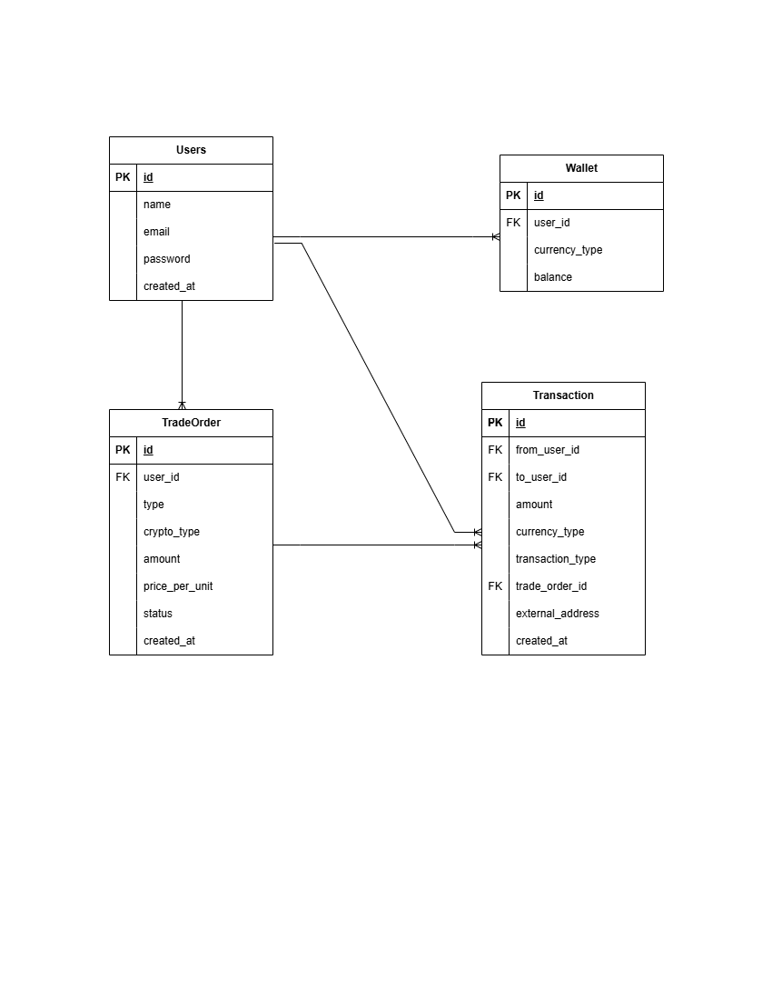

# crypto-exchange
Built With Docker, Node.js, Express.js, MySQL, and Sequelize.

# 🚀 Crypto Exchange Backend API

ระบบจำลอง Backend สำหรับการซื้อขายคริปโต สร้างด้วย:

- Node.js + Express
- Sequelize ORM
- MySQL (ผ่าน Docker)
- Docker Compose
- Seed Data สำหรับทดสอบระบบ

---

## 📦 Tech Stack

- Node.js
- Express.js
- Sequelize ORM
- MySQL 8
- mysql2 (MySQL driver สำหรับ Node.js)
- Docker & Docker Compose

---

## 🚀 วิธีใช้งาน (Run with Docker)

### 1. Clone โปรเจค

```bash
git clone https://github.com/NamfonSaphu/crypto-exchange.git
cd crypto-exchange
docker compose up -d
docker compose exec app node seed/seed.js

## 🗂️ ER Diagram

แสดงภาพรวมของความสัมพันธ์ระหว่าง Entity ต่างๆ ในระบบ:

